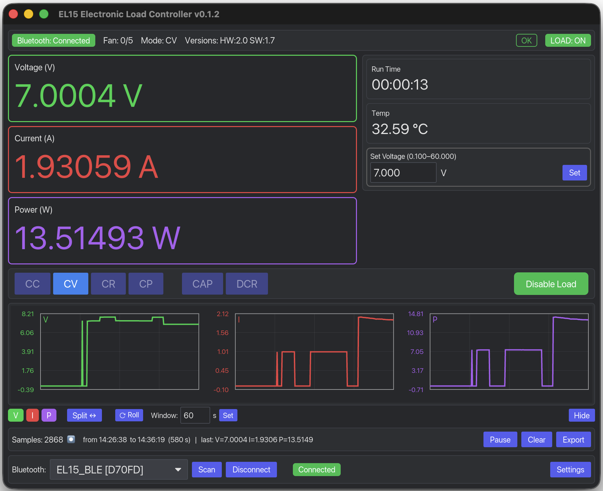

# EL15 Controller — Cross-Platform Electronic Load Software for ALIENTEK EL15 

**EL15** is an open-source, cross-platform controller for the **ALIENTEK EL15 programmable DC electronic load**, written in **Rust** with an **iced GUI**. It supports Bluetooth Low Energy control, real-time measurement monitoring, data export, USB HID firmware updates, command-line operation, and a SCPI/LXI raw-socket server partially compatible with RIGOL DL3000 workflows.

Run the single `el15` binary as a desktop application on **Windows, macOS, or Linux**, or use `--no-gui` for headless CLI and SCPI automation.

## Key features

* Native Rust desktop GUI built with iced
* Bluetooth Low Energy communication with the ALIENTEK EL15
* Real-time voltage, current, power, temperature, capacity, and energy monitoring
* CC, CV, CR, CP, battery-capacity, and internal-resistance operating modes
* CSV measurement export and time-aligned data export
* SCPI/LXI raw TCP server with partial RIGOL DL3000 command emulation
* Headless command-line mode for test benches and automation
* USB HID DFU firmware flashing for `.atk` firmware files
* Internationalised interface
* One executable for GUI, CLI, DFU, and SCPI operation

## Supported platforms

| Platform | Notes                                                 |
| -------- | ----------------------------------------------------- |
| Windows  | Requires libusb through vcpkg for source builds       |
| macOS    | Requires libusb through Homebrew for source builds    |
| Linux    | See `packaging/linux/README.txt` for GUI dependencies |

Supported features: GUI, CLI, BLE, USB DFU, SCPI

## GUI



## Workspace layout

| Crate               | Type | Purpose                                                                               |
| ------------------- | ---- | ------------------------------------------------------------------------------------- |
| `el15-bt`           | lib  | BLE protocol implementation, ported from [DM40GUI](https://github.com/maj113/DM40GUI) |
| `el15-scpi`         | lib  | SCPI/LXI raw-socket server emulating a RIGOL DL3000 electronic load                   |
| `el15-app`          | bin  | Single `el15` binary: iced GUI, headless CLI, USB DFU, and SCPI server                |
| `scripts/scpi-test` | bin  | Smoke tester for the built-in SCPI server                                             |

## Build from source

### Requirements

* Rust stable 1.75 or newer
* libusb 1.0:

  * macOS: `brew install libusb`
  * Debian/Ubuntu Linux: `apt install libusb-1.0-0-dev`
  * Windows: `vcpkg install libusb:x64-windows-static-md`
* Linux GUI dependencies documented in [`packaging/linux/README.txt`](packaging/linux/README.txt)

```bash
git clone https://github.com/rssdev10/el15.git
cd el15
cargo build --release

./target/release/el15         # Start the desktop GUI
./target/release/el15 --help  # Show CLI options
```

## Command-line examples

```bash
el15 --list-usb                          # Enumerate USB devices
el15 --no-gui --scan                     # Scan for BLE EL15 devices
el15 --no-gui --port 5555                # Connect to the first EL15 and run SCPI
el15 --no-gui --device <id>              # Connect to a specific BLE device
el15 --flash firmware/atk_el15_v1.7.atk  # Flash firmware through USB HID DFU
el15 --no-gui --log scpi.log -v          # Enable verbose SCPI file logging
```

## SCPI automation and partial RIGOL DL3000 emulation

The headless server exposes the EL15 over a raw TCP socket for laboratory automation, scripting, and integration with software that expects a RIGOL DL3000-compatible SCPI electronic load.

```bash
# Terminal 1: start the EL15 SCPI server
cargo run --release -p el15-app -- --no-gui --port 5555 -v

# Terminal 2: run the SCPI smoke test
cargo run --release -p scpi-test -- --port 5555
```

See [`docs/SCPI_PROTOCOL.md`](docs/SCPI_PROTOCOL.md) for the implemented command surface.

## Documentation

* [`docs/BT_PROTOCOL.md`](docs/BT_PROTOCOL.md) — ALIENTEK EL15 Bluetooth Low Energy wire protocol
* [`docs/SCPI_PROTOCOL.md`](docs/SCPI_PROTOCOL.md) — SCPI commands and RIGOL DL3000 emulation surface
* [`docs/CLI.md`](docs/CLI.md) — Complete command-line reference
* [`docs/SECURITY.md`](docs/SECURITY.md) — macOS and Linux USB permissions and code-signing notes

## Use cases

EL15 is intended for electronics labs, battery testing, power-supply testing, automated test equipment, hardware development, discharge measurements, capacity testing, and remote control of the ALIENTEK EL15 DC electronic load.

## License

MIT — see [`LICENSE`](LICENSE).
